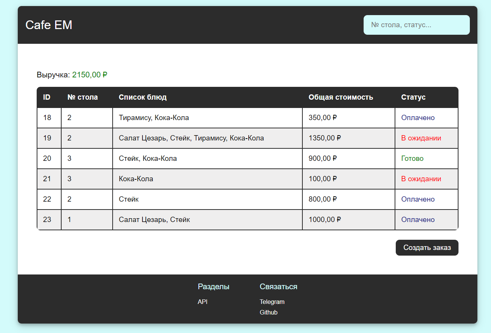

# Cafe EM

**Cafe EM** - это веб-приложение для управления заказами в кафе.

# Содержание

- **[Технологии и инструменты](#технологии-и-инструменты)**

## Технологии и инструменты

### Языки программирования и фреймворки

- **Python 3.11**
- **Django 5**

### Инструменты разработки
- **Mypy**
- **Flake8**
- **Black**
- **Isort**
- **Pre-commit**
- **Poetry**
- **Git**
- **GitHub**

### Базы данных
- **PostgreSQL**

### Web технологии
- **HTML**
- **CSS**
- **JavaScript**
- **JQuery**

### Серверные технологии и безопасность
- **CSP**
