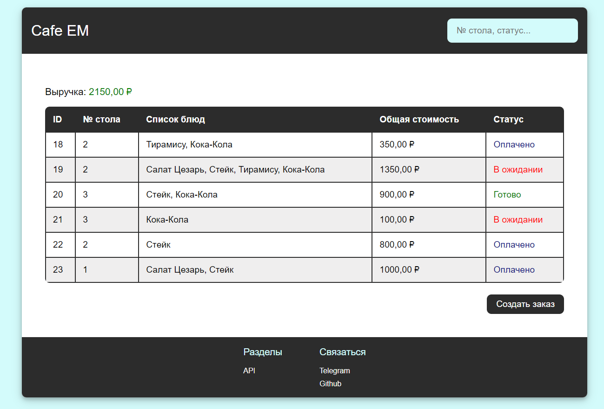
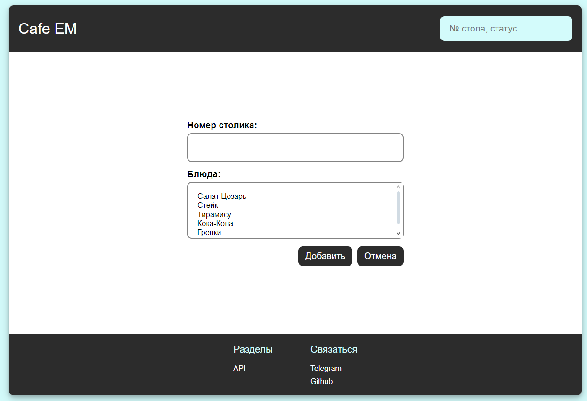
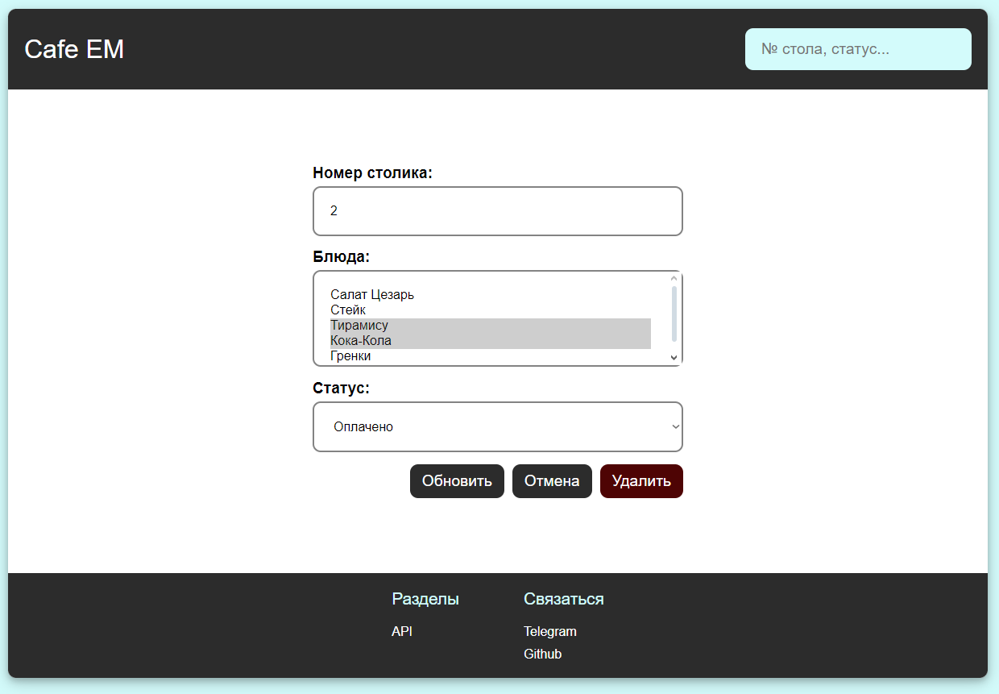
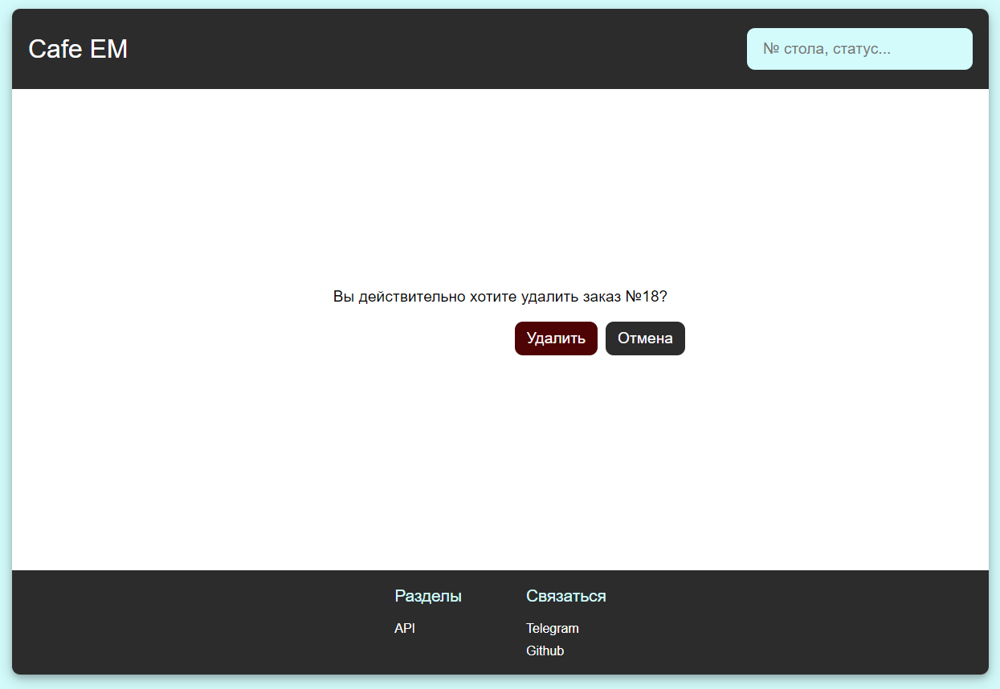
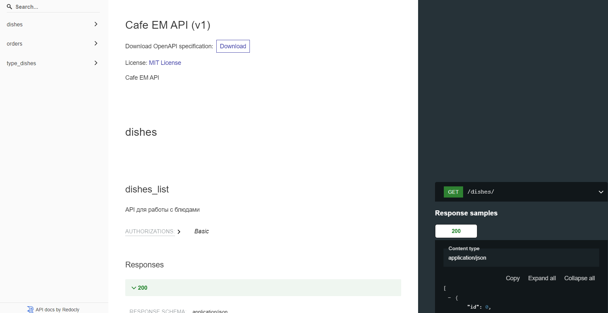

# Cafe EM

**Cafe EM** - это веб-приложение для управления заказами в кафе.



# Содержание

- **[Технологии и инструменты](#технологии-и-инструменты)**
- **[Функциональсть](#функциональность)**
- **[API](#api)**

## Технологии и инструменты

### Языки программирования и фреймворки

- **Python 3.11**
- **Django 5**

### Инструменты разработки
- **Mypy**
- **Flake8**
- **Black**
- **Isort**
- **Pre-commit**
- **Poetry**
- **Git**
- **GitHub**

### Базы данных
- **PostgreSQL**

### Web технологии
- **HTML**
- **CSS**
- **JavaScript**
- **JQuery**

### Серверные технологии и безопасность
- **CSP**

## Функциональность
- ### **Просмотр заказов** - страница с общей таблицей всех заказов ```orders/```


Каждая запись кликабельна и ведет на адрес ```orders/<int:pk>/update/```.

На странице работает поиск по № стола и статусу заказа.

Также на странице есть автоматический расчет выручки по заказам со статусом «Оплачено».

- ### **Добавление заказа** - страница с формой добавления заказа ```orders/create/```



- ### **Редактирование заказа** - страница с формой изменения заказа ```orders/<int:pk>/update/```



- ### **Удаление заказа** - страница с формой удаления заказа ```orders/<int:pk>/delete/```



## API

OpenAPI - ```/api/redoc/```


